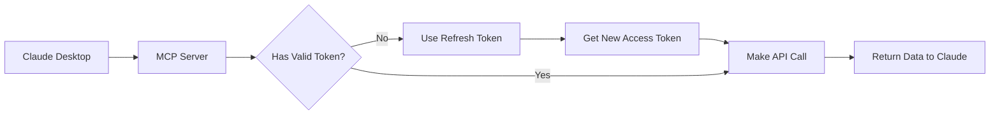

# 🔐 Teamleader OAuth + Claude Desktop Setup

## How OAuth Works with Claude Desktop

### 🎯 The Problem
- Teamleader requires OAuth login (browser-based)
- Claude Desktop can't open browsers
- Solution: Get refresh token ONCE, use forever

## 📋 Step-by-Step OAuth Setup

### 1. Get Your Teamleader App Credentials

1. Go to: https://marketplace.teamleader.eu/
2. Click "Create new integration" 
3. Fill in:
   - **Name**: Claude Desktop MCP
   - **Redirect URI**: `http://localhost:8080/callback`
4. Save and copy:
   - Client ID
   - Client Secret

### 2. Generate Your Refresh Token

```bash
cd teamleader-mcp
node scripts/generate-token.js
```

What happens:
1. Script asks for Client ID & Secret
2. Gives you a URL
3. You login in browser
4. Copy the 'code' from redirect URL
5. Script exchanges for refresh token

### 3. Configure Claude Desktop

Add to `~/.config/claude/claude_desktop_config.json`:

```json
{
  "mcpServers": {
    "teamleader": {
      "command": "node",
      "args": ["/full/path/to/teamleader-mcp/dist/server.js"],
      "env": {
        "TEAMLEADER_CLIENT_ID": "your-client-id-here",
        "TEAMLEADER_CLIENT_SECRET": "your-secret-here",
        "TEAMLEADER_REFRESH_TOKEN": "your-refresh-token-here"
      }
    }
  }
}
```

### 4. How It Works After Setup



## 🔄 Token Lifecycle

- **Access Token**: Valid for 1 hour
- **Refresh Token**: Valid for 14 days (auto-renewed on use)
- **MCP Server**: Handles refresh automatically

## 🚨 Common Issues & Fixes

### "Authentication failed"
- Check all 3 credentials are set
- Refresh token might be expired (>14 days unused)
- Re-run `generate-token.js`

### "No tools available"
- MCP server not starting properly
- Check full path to server.js
- Look at Claude Desktop logs

### "Token expired"
- Normal! MCP should auto-refresh
- If not, check CLIENT_ID and SECRET

## 🛡️ Security Notes

1. **Never share** your refresh token
2. **Store securely** in Claude config (not in code)
3. **Tokens are scoped** to your Teamleader account
4. **Revoke access** at marketplace.teamleader.eu if needed

## 📝 Quick Test

After setup, ask Claude:
```
"Show me my Teamleader companies"
```

If it works, you'll see your company list!

## 🔧 Debug Mode

For troubleshooting, add debug flag:

```json
{
  "mcpServers": {
    "teamleader": {
      "command": "node",
      "args": ["/path/to/dist/server.js"],
      "env": {
        "DEBUG": "teamleader:*",
        "TEAMLEADER_CLIENT_ID": "...",
        "TEAMLEADER_CLIENT_SECRET": "...",
        "TEAMLEADER_REFRESH_TOKEN": "..."
      }
    }
  }
}
```

## 🎉 Success Checklist

- [ ] Created Teamleader app
- [ ] Got Client ID & Secret
- [ ] Generated refresh token
- [ ] Added to Claude config
- [ ] Restarted Claude Desktop
- [ ] Tested with simple query
- [ ] 🎉 Managing Teamleader from Claude!